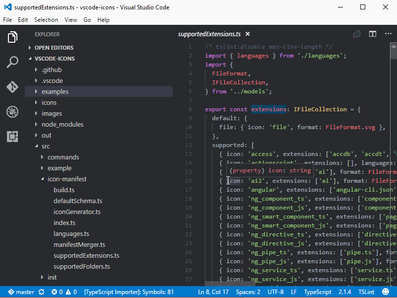

<h1 align="center">Hiring Coders - Desafio Final (VTEX IO + AWS)
	<br/>
	
	<br/>
</h1>

[](https://github.com/danicaus)
[](https://github.com/danicaus)
[](#)
[](https://github.com/danicaus/hcdesafiofinal-aws/stargazers)
[](https://github.com/danicaus/hcdesafiofinal-aws/network/members)
[](https://github.com/danicaus/hcdesafiofinal-aws/graphs/contributors)

---

# :pushpin: Table of Contents

- :house: [About](#about)
- :dart: [Installation](#Installation)
  - :gear: [Install dependencies](##Install_dependencies)
  - :rocket: [Getting Started](##Getting_Started)
- :computer: [Techs](#Techs)
- :bust_in_silhouette: [Author](#Author)
- :handshake: [Contributing](#Contributing)
- :scroll: [License](#License)

---

# :house: About

This repository is the final challenge delivered in the last phase of Hiring Coders 2.

The challenge is to design an AWS themed page using VTEX IO.

We will tell two views:

- Consumer experience
  - When entering the page, the user will find a modal with a form to register to receive news.
  - With the modal we will collect the following information:
    - Name
    - The e-mail
    - Telephone
  - When leaving the modal, the customer will find a page with AWS services with product offers with prices.
  - From the top menu, the customer can navigate to an "About" page where they can get information about the AWS Mission, Vision and Values, as per the [original AWS page](https://aws.amazon.com/pt/about-aws).
  - By clicking on the button "add to cart" the service is added a cart that can be followed by clicking on the top icon with a shopping cart image.
  - When finalizing the purchase, the customer is directed to a checkout page, where card, E-mail and Telephone data will be collected. We will collect this information with our API.

- Employee experience
  - The AWS employee will have a page, within the VTEX IO system, where he can manage leads and customers.
  - Consumers who register in the form on the homepage, by default, will be registered as "prospects".
  - Consumers, when making their first purchase, will be classified as "customers".
  - The initial idea is that prospects who carry out buy their status automatically changed by the system.
  - This admin page will have a list of leads with the following fields:
  	- Name
		- The e-mail
		- Telephone
		- Status
  - The employee will update the lead status from "prospect" to "customer".

---

# :dart: Installation

**First you need to install:**

- [Node.js](https://pt-br.nodejs.org/) (required)
- [Yarn](https://yarnpkg.com/) (required)
- [VTEX Toolbelt](https://vtex.io/docs/recipes/development/vtex-io-cli-install/) (required)

  **Then in order, clone the project.**

By HTTPS, running this command:

```bash
  git clone https://github.com/danicaus/hcdesafiofinal-aws.git
```

Or by ssh, running this command:

```bash
  git clone git@github.com:danicaus/hcdesafiofinal-aws.git
```

SSH is a secure protocol, but you need to register a key ssh in your github before.

## :hammer_and_wrench: Install dependencies

```bash
  yarn global add vtex
```

## :rocket: Getting Started

```bash
  vtex login {your name workspace}
```
```bash
  vtex use {your name workspace}
```
```bash
	vtex browse {your name workspace}
```

---

# :computer: Techs

- Front-End

[](#)
[](#)
[](#)
[](#)

- Back-End

[](#)
[](#)
[](#)
[](#)

- Testes

[](#)

- Databases

[](#)

---

# :bust_in_silhouette: Author

<table>
	<tr>
		<td align="center">
			<a href="https://github.com/AdamsFlorisbal">
				
				<br />
				<sub>
					<b>Adams Gawlinski<br>Florisbal</b>
				</sub>
			</a>
		</td>
		<td align="center">
			<a href="https://github.com/cvscaminha">
				
				<br />
				<sub>
					<b>Cristiano Vieira<br>de Sa Caminha</b>
				</sub>
			</a>
		</td>
		<td align="center">
			<a href="https://github.com/danicaus">
				
				<br />
				<sub>
					<b>Daniela<br>Caus</b>
				</sub>
			</a>
		</td>
		<td align="center">
			<a href="https://github.com/danilomds">
				
				<br />
				<sub>
					<b>Danilo<br>Mendes</b>
				</sub>
			</a>
		</td>
		<td align="center">
			<a href="https://github.com/drielesoriano">
				
				<br />
				<sub>
					<b>Driele<br>S. Soriano</b>
				</sub>
			</a>
		</td>
	</tr>
	<tr>
		<td align="center">
			<a href="https://github.com/giselemascarenhas">
				
				<br />
				<sub>
					<b>Gisele<br>R. Mascarenhas</b>
				</sub>
			</a>
		</td>
		<td align="center">
			<a href="https://github.com/ivancmc">
				
				<br />
				<sub>
					<b>Ivan<br>Cardoso</b>
				</sub>
			</a>
		</td>
		<td align="center">
			<a href="https://github.com/leomssilva">
				
				<br />
				<sub>
					<b>Leonardo<br>M. S. da Silva</b>
				</sub>
			</a>
		</td>
		<td align="center">
			<a href="https://github.com/natansouzaa">
				
				<br />
				<sub>
					<b>Natan<br>Souza</b>
				</sub>
			</a>
		</td>
		<td align="center">
			<a href="https://github.com/pesdesigner">
				
				<br />
				<sub>
					<b>Paulo<br>Eduardo</b>
				</sub>
			</a>
		</td>
	</tr>
</table>

---

# :handshake: Contributing

Contributions, issues and feature requests are welcome! Feel free to **file a new issue** on the [hcdesafiofinal-aws](https://github.com/danicaus/hcdesafiofinal-aws/issues) repository. If you already found a solution to your problem, **I would love to review your pull request**!

---

# :scroll: License

Copyright :copyright: 2021 [Adams Gawlinski Florisbal, Cristiano Vieira de Sa Caminha, Daniela Caus, Danilo Mendes, Driele S Soriano, Gisele R. Mascarenhas, Ivan Cardoso, Leonardo M. S. da Silva, Natan Souza, Paulo Eduardo](https://github.com/danicaus).
<br/>
This project is [MIT](https://github.com/danicaus/hcdesafiofinal-aws/blob/main/LICENSE) licensed.

---